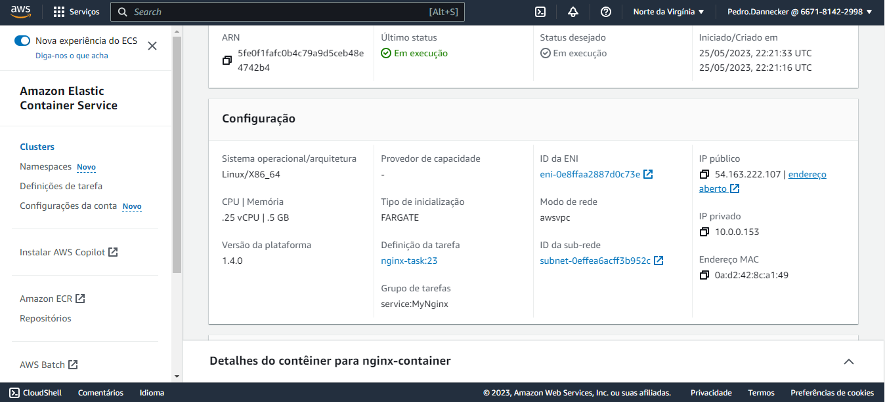

# Projeto Fargate ECS
## Descrição

Criação de micro serviços que são alocados em containers hospedados pela Fargate, e esses seriam administrados pela ferramenta ECS. O primeiro é uma ferramenta que permite rodar os contêiner quando necessário utilizando outros servers e toda a gestão da OS dos contêiners é trabalho do fargate, dessa maneira o usuário só precisa se preocupar com o deploy e pagará apenas o que seu serviço consumir por hora enquanto estiver ativo. Já o ECS, é um serviço de administração em que será possível visualizar quanto ainda tem de espaço disponível, se algum contêiner parou de funcionar, retornar informações uteis de funcionamento...

## Configuração

Como nesse projeto iremos utilizar os recursos da AWS, é necessário baixar o aws cli e configurar suas chaves de acesso e a região que será utilizada,nesse caso **"us-east-1"**.  Esse console permite interagir e gerenciar serviços AWS além de automatizar tarefas e administrar recursos. Este [guia](https://docs.aws.amazon.com/cli/latest/userguide/welcome-examples.html) oficial da Amazon pode ser útil. 

## Desenvolvimento

### VPC

Primeiramente deve-se criar uma **VPC**(Virtual Private Cloud), um serviço que permite isolar seus recursos em um ambiente virtual privado na nuvem, além da personalização de sua rede e controle de sua infraestrutura. Nesse projeto, uma VPC foi criada e a partir dela criou-se uma **sub-rede** pública com disponiblidade para a região configurada no AWS cli, "us-east-1". Ademais, para haver conexão com a internet foi criado um **gateway**, que a partir da definição de **rota** foi associado com a sub-rede criada anteriormente. 

```tf
#Criando rede
resource "aws_vpc" "main" {
  cidr_block = "10.0.0.0/16"
}

# Criando gateway para a internet
resource "aws_internet_gateway" "main" {
  vpc_id = aws_vpc.main.id
}


# Criando subnet
resource "aws_subnet" "public_subnet_a" {
  vpc_id                  = aws_vpc.main.id
  cidr_block              = "10.0.0.0/24"
  availability_zone       = "us-east-1a"
  map_public_ip_on_launch = true
}


resource "aws_route_table" "public" {
  vpc_id = aws_vpc.main.id
}
 
resource "aws_route" "public" {
  route_table_id         = aws_route_table.public.id
  destination_cidr_block = "0.0.0.0/0"
  gateway_id             = aws_internet_gateway.main.id
}
 
resource "aws_route_table_association" "public" {
    subnet_id      = aws_subnet.public_subnet_a.id
    route_table_id = aws_route_table.public.id
}

```
A ultima configuração feita na rede foi o **security group**, um firewall virtual que define as regras de ingresso e egresso do tráfego de rede. Define-se aqui o ingresso apenas pela porta 80, que será definida como a porta de acesso do conteiner mais adiante, e o egresso sem restrições, facilitando o acesso a servidores que contenham as imagens de aplicações a serem executadas em containers. 

```tf
resource "aws_security_group" "ecs_tasks" {
  name   = "white-hart-sg-task-foo"
  vpc_id = aws_vpc.main.id
 
  ingress {
   protocol         = "tcp"
   from_port        = 80
   to_port          = 80
   cidr_blocks      = ["0.0.0.0/0"]
   ipv6_cidr_blocks = ["::/0"]
  }
 
  egress {
   protocol         = "-1"
   from_port        = 0
   to_port          = 0
   cidr_blocks      = ["0.0.0.0/0"]
   ipv6_cidr_blocks = ["::/0"]
  }
}

```


### Cluster

Com sua rede de uso pronta, agora deve-se criar um **cluster** ECS Fargate, um grupo lógico de recursos de computação em nuvem onde você pode executar e gerenciar os contêineres de suas tarefas em questão. A criação do cluster é feita apenas com as default options, caso queira definir o tipo de cluster e suas configurações como capacidade de computação por exemplo, deve-se usar **capacity providers**, que no caso abaixo está definindo que o cluster **foo** utilizará o Fargate. 

```tf
#Criando cluster ECS
resource "aws_ecs_cluster" "foo" {
  name = "white-hart"

  setting {
    name  = "containerInsights"
    value = "enabled"
  }
}

#Definindo uso do Fargate
resource "aws_ecs_cluster_capacity_providers" "foo" {
  cluster_name = aws_ecs_cluster.foo.name

  capacity_providers = ["FARGATE"]

  default_capacity_provider_strategy {
    base              = 1
    weight            = 100
    capacity_provider = "FARGATE"
  }
}

```

### Service e Task

Finalizando nosso desenvolvimento devemos definir o **serviço** e a **tarefa**. O primeiro, que está na sub-rede criada anteriormente, permite o gerenciamento de um grupo de tarefas e monitorando o funcionamneto dessas, por exemplo caso uma tarefa pare de funcionar ou for finalizada o serviço irá inicializar uma nova automaticamente. É o serviço que gerenciará as regras de firewall criadas anteriormente e por estarmos usando Fargate vamos acionar seu recurso de gerar um IP público para dessa maneira conseguirmos acessar nossa aplicação pela internet. 

```tf
#Serviço com task nginx
resource "aws_ecs_service" "MyNginx" {
  name              = "MyNginx"
  cluster           = aws_ecs_cluster.foo.id
  task_definition   = aws_ecs_task_definition.nginx_task.arn
  launch_type       = "FARGATE"
  desired_count     = 1 
  network_configuration {
    subnets          = [aws_subnet.public_subnet_a.id]
    security_groups  = [aws_security_group.ecs_tasks.id]
    assign_public_ip = true

  }
  depends_on = [aws_ecs_task_definition.nginx_task]

}

```

Já as tarefas definem quais conteiners devem ser executados e como devem ser configurados. No nosso caso iremos configurar um conteiner que use o modo de rede vpc definido anteriormente, tenha 256 de CPU e 512 de memória, além de ser compatível com o Fargate. Feito isso, o principal é a aplicação, onde configuramos para o conteiner buscar a imagem mais atual que o repositório Docker possui do Nginx e indicamos que a porta de acesso a esse conteiner será a 80 do protocolo tcp, a qual foi liberada no grupo de segurança feito inicialmente. Apesar do exemplo feito ter sido com Nginx existem inúmeros outras possibilidades.

```tf
# definição task nginx
resource "aws_ecs_task_definition" "nginx_task" {
  family                   = "nginx-task"
  network_mode             = "awsvpc"
  cpu                      = "256"
  memory                   = "512"
  requires_compatibilities = ["FARGATE"]
  execution_role_arn       = aws_iam_role.ecs_task_execution_role.arn
  task_role_arn            = aws_iam_role.ecs_task_role.arn

  container_definitions = <<TASK_DEFINITION
  [
    {
      "name": "nginx-container",
      "image": "nginx:latest",
      "portMappings": [
        {
          "containerPort": 80,
          "protocol": "tcp"
        }
      ]
    }
  ]
  TASK_DEFINITION
}
```


## Como usar

Para utilizar esse projeto você deve clonar este repositório, e dentro dele rodar no terminal os comandos **terraform init** e **terraform apply**. Agora ao entrar na plataforma da AWS poderá checar o funcionamento de suas criações.

Ao entrar na plataforma procure por **"ECS"**, será a primeira opção.


Dentro da área ECS selecione a aba **"clusters"** e verá o cluster que acabamos de criar.


Selecione esse cluster e observe os serviços contidos nele.


Para checar as tarefas desse serviço pode-se seleciona-lo assim como feito com o cluster ou apenas trocar para a aba de tarefas.


Ao selecionar a tarefa encontrará o IP público atribuído a ela e pelo qual você poderá acessar e visualizar o NGINX.




Para apagar tudo que foi feito deve-se rodar o comando **terraform destroy**.